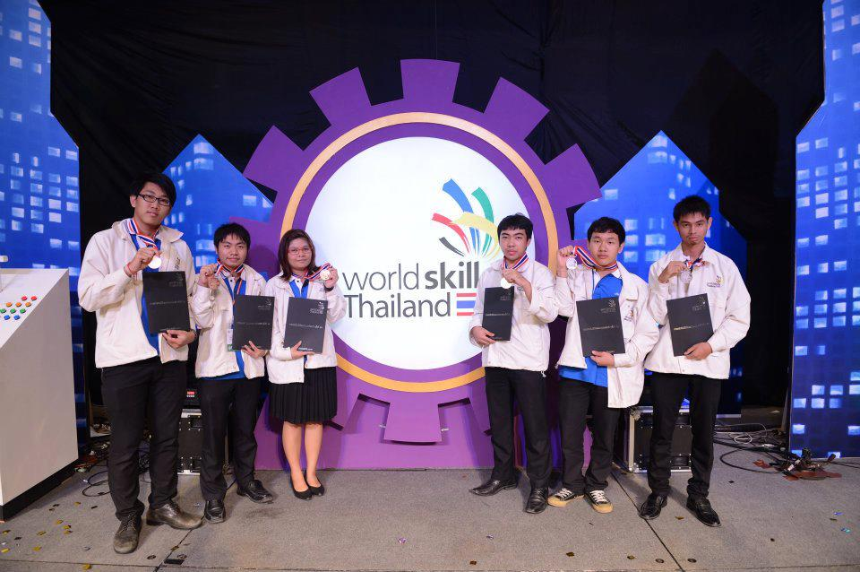
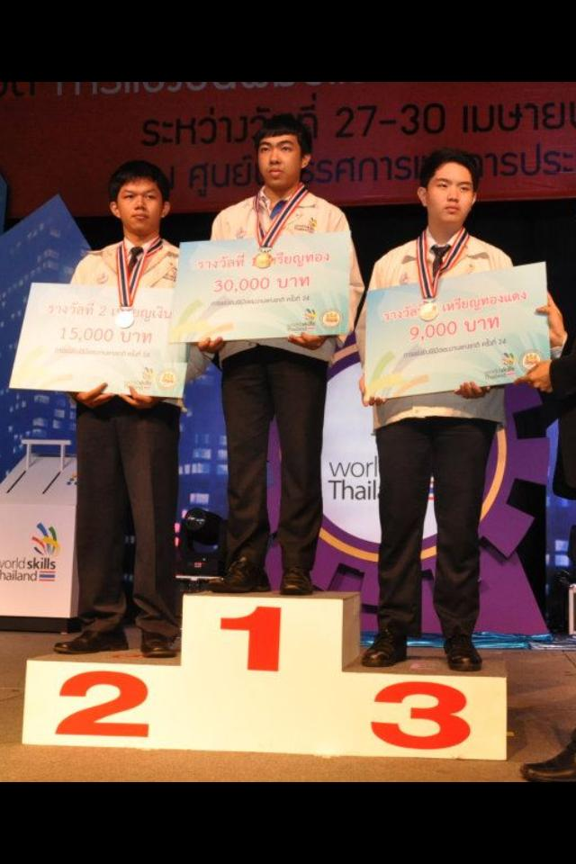

แนะนำให้รู้จักกับ WorldSkill Thailand กันบ้างครับ

<!--WorldSkill Thailand-->

WorldSkill Thailand
ผมได้มีโอกาศไปแข่งรายการนี้ในสาขา Web Design ซึ่งได้รางวัลที่ 1 ในระดับประเทศครับ

ในรายการนี้นั้นผู้ที่จะเข้าร่วมได้ต้องไปแข่งในระดับภาคมีประมาณ 12 ภาค ทั่วประเทศและเอาที่ 1 ของแต่ละภาคเข้ามาแข่งในระดับประเทศ เพื่อเอาที่ 1-3 ไปเก็บตัวแข่งขันในระดับ Asean และ World ต่อไป

การแข่งขันนี้เป็นการแข่งขันในกลุ่มของเด็กอาชีวะ ซึ่งจะมีกลุ่มสาขาหลายๆ สาขาซึ่งจริงๆ แล้วสามารถเข้าไปหาข้อมูลเพิ่มเติมได้ที่ https://www.worldskills.org/

WorldSkills is showcasing the value of skills and raising the recognition of skilled professionals worldwide.

Skills are the foundation of modern life. Everything, from the houses we live in to the societies we create, is the result of skills. They are the driving force behind successful careers and companies, thriving industries, and economies. Skills keep the world working.
<!--

Wow! I love blogging so much already.

Did you know that "despite its name, salted duck eggs can also be made from chicken eggs, though the taste and texture will be somewhat different, and the egg yolk will be less rich."? ([Wikipedia Link](http://en.wikipedia.org/wiki/Salted_duck_egg))

Yeah, I didn't either.
-->
