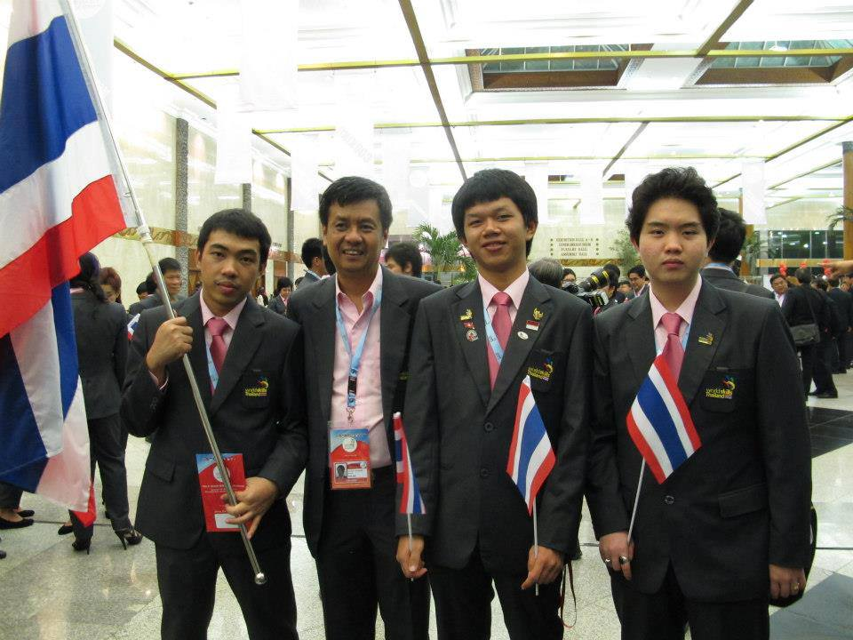

แนะนำให้รู้จักกับ WorldSkill Asean กันบ้างครับ

<!--WorldSkill Asean -->

WorldSkill Asean
หลังจากที่ผมได้รับรางวัลที่ 1 ของรายการนี้ก็ได้สิทธิไปแข่งที่ Jakarta Indonesia เป็นตัวแทนประเทศไทย และได้รับรางวัลชมเชย โดยคะแนนเป็นระดับที่ 4

สุดท้ายในด่านต่อไป ถ้ารัฐบาลมีงบคงได้ไป WorldSkill ที่เยอรมันครับ

Changelog: ในปีนี้รัฐไม่สามารถส่งไปแข่งได้จึงไม่ได้ไปเยอรมัน ต่อไปผมก็คงกลับไปเรียนเหมือนเดิมครับ ซึ่งตอนนี้ช้าไป 1 ปี จบช้ากว่าเพื่อน 😉

The idea to hold the ASEAN Skills Competition (ASC) came about during the Preparatory Meeting of ASC, organised by the Asian and Pacific Skill Development Programme, which was held in Chiba, Japan in September 1993. This recommendation was subsequently endorsed at the 10th ASEAN Labour Minister’s Meeting held in Singapore in May 1994. Following this, the first ASEAN Skills Competition was held in Kuala Lumpur Malaysia in 1995.

Today, every two years, over 200 of the best young professionals from trades, services and vocational programmes around South East Asia gather to showcase their talents and abilities in over 15 skills categories. Participants compete for gold, silver and bronze medals over a three-day competition.

The ASC provides an opportunity for the exchange of knowledge, expertise and experience among delegates from member countries. This “meeting of minds” will help to synergise the individual efforts of member countries to enhance skills training and standards in the region.

<!--*This post is going to be a little hard to read for those that don't speak latin.*

Lorem ipsum dolor sit amet, consectetur adipiscing elit. Integer vel neque dignissim mi maximus interdum. Cras dictum quam et ex molestie facilisis. Proin dapibus sed sapien nec gravida. Praesent at leo ut erat varius rhoncus at non mi. Quisque cursus non leo et varius. Maecenas porttitor scelerisque sapien at venenatis. Proin pellentesque gravida elementum. Nam eget porttitor ligula. Vestibulum ante ipsum primis in faucibus orci luctus et ultrices posuere cubilia Curae; Aenean nec commodo lacus, eu mollis nisi. Nullam felis mi, tempus ac ipsum a, venenatis blandit magna. Sed mattis magna est, quis tincidunt massa aliquam vitae. Ut in ipsum blandit, ultrices lacus a, condimentum nibh. Sed commodo, lorem eget interdum molestie, lacus nisi lacinia velit, tempus commodo lacus erat porttitor dolor.

Phasellus vitae ante justo. Fusce dui elit, finibus non posuere sed, ullamcorper at odio. Pellentesque habitant morbi tristique senectus et netus et malesuada fames ac turpis egestas. Pellentesque molestie lorem dolor, eget tincidunt ligula suscipit sit amet. Maecenas tempor nulla orci, sed scelerisque massa convallis id. Fusce iaculis nibh et lectus bibendum viverra. Nulla volutpat vehicula tortor non cursus. Maecenas vulputate mi nec accumsan ultricies. Praesent vitae tellus ligula. Praesent placerat fringilla purus, ac fermentum ipsum faucibus sed. Fusce semper, sapien hendrerit fringilla sagittis, lacus felis accumsan tellus, ac mollis ex arcu vitae lorem. Duis vitae semper felis. Duis consectetur, diam id laoreet suscipit, felis felis imperdiet sem, vel posuere leo ligula nec sapien. Maecenas at imperdiet nulla. Quisque quam nibh, feugiat vitae rhoncus ac, hendrerit eu quam. Cum sociis natoque penatibus et magnis dis parturient montes, nascetur ridiculus mus.

Nullam vehicula lorem sed felis rutrum gravida. Nam mattis cursus lacinia. Cras sit amet interdum elit. Morbi viverra, est a tincidunt facilisis, est est maximus urna, id rhoncus mi metus et lacus. Pellentesque finibus ex vel nulla fermentum tempus. Nunc vel lorem enim. Sed varius scelerisque nulla, nec ultrices ligula gravida eu. Curabitur eu turpis sit amet nisl vehicula tempor ultrices eu lacus. Curabitur malesuada nulla neque. Aenean mattis lectus ex, molestie ultricies elit fringilla eget. Quisque iaculis volutpat nisl, vitae lobortis ipsum elementum sed. Nulla facilisi. Maecenas cursus turpis ac lacus efficitur, non bibendum ligula consequat. Pellentesque habitant morbi tristique senectus et netus et malesuada fames ac turpis egestas. Mauris accumsan placerat felis, at bibendum ante.

Quisque varius dui vel commodo lobortis. Vestibulum eu metus vel dui lobortis volutpat. Cras vitae neque ornare, vehicula urna et, efficitur dolor. Nunc congue euismod leo non rhoncus. Nulla mollis libero a ullamcorper placerat. Morbi bibendum viverra orci in auctor. Donec in est varius, hendrerit risus vitae, commodo purus. Praesent eget rhoncus ligula. Suspendisse quis ultricies ligula. Nullam tincidunt rutrum nisl eget luctus. Phasellus eget nulla semper, varius ligula a, gravida urna. Etiam tempor feugiat elit eu cursus. Donec tristique ligula a aliquam tempor.

Proin nec nunc tellus. Donec sapien leo, ornare quis condimentum a, euismod sit amet augue. Aliquam tincidunt mauris at arcu suscipit, quis scelerisque justo rhoncus. Vestibulum lobortis dui at odio lacinia mattis. Praesent nunc urna, bibendum ut dui eget, consequat suscipit leo. Curabitur auctor vel dui fermentum auctor. Sed ultrices ligula mauris, id blandit sapien ultrices id. Morbi volutpat tortor quis ex convallis aliquam. Nunc eleifend risus eget dui condimentum scelerisque.-->
